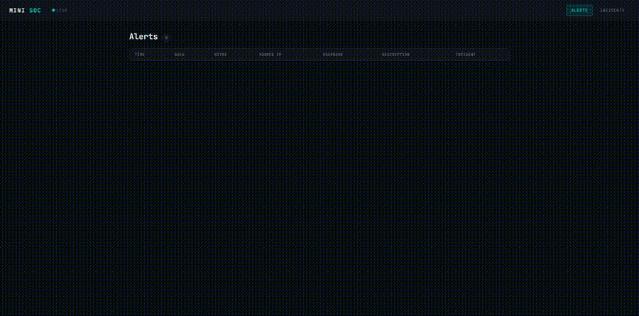

# Mini SOC — Security Monitoring & Detection Lab



A Security Operations Center (SOC) pipeline, built as a portfolio project.

The system simulates a small organization's infrastructure, runs controlled attacks against it, and
detects the resulting malicious activity through a log/packet/file-integrity collection → detection →
alerting → correlation pipeline.

## Status

Planned roadmap (10 phases) complete. See [Roadmap](#roadmap) for possible future work.

| Phase | Delivered |
|---|---|
| 0 | Docker lab environment (attacker + target containers) |
| 1 | Log collection & normalization (Python → PostgreSQL) |
| 2 | Detection engine — SSH brute-force rule, MITRE ATT&CK tagging |
| 3 | REST API (FastAPI) — alerts, alert detail with evidence trail, raw events |
| 4 | Dashboard (React) — alert list, click-through incident timeline showing raw evidence |
| 5 | SSH reconnaissance/banner-grab detection; web target with signature-based detection of suspicious HTTP requests (SQLi, path traversal, sensitive-file probing) |
| 6 | Live dashboard auto-refresh (polls the API every 5s, no manual refresh) |
| 7 | Event correlation — alerts from the same source IP within a rolling window grouped into one incident, exposed via the API and a dedicated Incidents view, cross-linked with alerts in both directions |
| 8 | Packet-level scan detection — `ssh-target` runs `tcpdump` to capture raw inbound SYN packets, closing the gap where a bare TCP port scan (one that never speaks SSH) leaves no trace in `auth.log` |
| 9 | Privilege-escalation scenario + file-integrity monitoring — `ssh-target` ships a deliberate passwordless-sudo misconfiguration; a background watcher hashes security-critical files and maps any unauthorized change to its specific MITRE technique |
| 10 | Automated tests for the log-parsing layer; one-command `./attack.sh` demo firing every attack scenario in sequence, producing a full multi-stage incident from a single command |

## Detection rules

| Rule | Trigger | MITRE Technique | Data source |
|---|---|---|---|
| `ssh_brute_force` | 4+ failed SSH logins from one IP within 60s | T1110 — Brute Force | `ssh-target` auth.log |
| `ssh_recon_scan` | 2+ SSH banner-grab/recon probes from one IP within 60s | T1595 — Active Scanning | `ssh-target` auth.log |
| `web_attack_probing` | 3+ suspicious HTTP requests from one IP within 60s | T1190 — Exploit Public-Facing Application | `web-target` access.log |
| `port_scan_detected` | 5+ distinct destination ports probed by one IP within 10s | T1046 — Network Service Scanning | `ssh-target` raw packet capture (`tcpdump`) |
| `file_integrity_violation` | Any hash change to a watched file | Varies by file — e.g. T1098.004 for `authorized_keys`, T1136.001 for `/etc/passwd`, T1548.003 for `/etc/sudoers` | `ssh-target` file hash watcher (`fim-watch.sh`) |

Alerts with a source IP are further correlated: any two such alerts from the same IP within a
10-minute window are grouped into one **incident**, regardless of which rule(s) fired.
`file_integrity_violation` alerts have no source IP (see Design notes) and don't currently
participate in correlation.

## Architecture (current)

```
[Attacker container: Kali + Hydra + nmap + curl + openssh-client + sshpass]
        │
        ├─ SSH brute-force / recon / port scan / (post-login) priv-esc ──┐
        │                                                                 ▼
        │                     [ssh-target: Ubuntu + sshd + rsyslog + tcpdump + fim-watch.sh]
        │                                                                 │ writes /var/log/auth.log
        │                                                                 │ writes /var/log/tcpdump-syn.log
        │                                                                 │ writes /var/log/fim.log
        │                                                                 ▼
        │                                                      [Host-mounted log volume]
        │
        └─ Suspicious HTTP requests ─────────┐
                                              ▼
                              [web-target: nginx]
                                              │ writes /var/log/nginx/access.log
                                              ▼
                                   [Host-mounted log volume]
                                              │
                                              ▼
                         [log-collector/parser.py]  — one thread per source (auth.log,
                         │                             access.log, tcpdump-syn.log, fim.log),
                         │                             each with its own DB connection;
                         │                             parses lines, normalizes into events
                         ▼
                [PostgreSQL: events table]
                         │
                         ▼
          [detection-engine/detector.py]  — polls events every 5s,
          │                                  applies 5 rules (4 threshold-based, 1
          │                                  fire-on-any-occurrence), then correlates
          │                                  new IP-attributed alerts into incidents
          ▼
[PostgreSQL: alerts table] ──┐  [PostgreSQL: incidents table]
          │                  └──────────────┘  (alerts.incident_id links the two)
          ▼
   [api/main.py]  — FastAPI REST API
          │          GET /alerts, /alerts/{id}, /incidents, /incidents/{id}, /events
          ▼
   [dashboard/]  — React (Vite) frontend
                  polls /alerts and /incidents every 5s; Alerts and Incidents tabs,
                  cross-linked, with click-through incident timelines
```

## Components

| Component | Tech | Purpose |
|---|---|---|
| `ssh-target` | Docker, Ubuntu, OpenSSH, rsyslog, tcpdump, bash | Simulated vulnerable Linux server: SSH auth logging, raw SYN capture (catches scans that never speak SSH), and a background file-integrity watcher over security-critical files. Ships a deliberate passwordless-sudo misconfiguration for the privilege-escalation scenario. |
| `web-target` | Docker, nginx | Simulated web server; access log used for signature-based attack detection |
| `attacker` | Docker, Kali Linux, Hydra, nmap, curl, openssh-client, sshpass | Controlled attack execution, including non-interactive scripted scenarios |
| `postgres` | PostgreSQL 16 | Stores structured events, alerts, and incidents |
| `log-collector/parser.py` | Python, psycopg2, threading | Tails auth.log, access.log, the tcpdump SYN capture, and the file-integrity log concurrently, parses and normalizes lines into the `events` table |
| `detection-engine/detector.py` | Python, psycopg2 | Polls `events`, applies detection rules, writes `alerts`, and correlates IP-attributed alerts into `incidents` by source IP + time window |
| `api/main.py` | Python, FastAPI, uvicorn | REST API exposing alerts, alert detail with linked events, incidents, incident detail with linked alerts, and raw events |
| `dashboard/` | React, Vite | Web UI — live-polling Alerts and Incidents tabs, cross-linked, with click-through incident timeline showing raw evidence per alert |

## Running it locally

Requires Docker and Docker Compose.

```bash
docker compose up -d --build
```

This starts the SSH target, web target, attacker container, and PostgreSQL.

Then, in separate terminals (each with its own venv):

```bash
# Terminal 1 — log collector (watches auth.log, access.log, tcpdump SYN capture, and fim.log)
cd log-collector && source venv/bin/activate && python3 parser.py

# Terminal 2 — detection engine
cd detection-engine && source venv/bin/activate && python3 detector.py

# Terminal 3 — API
cd api && source venv/bin/activate && uvicorn main:app --reload --port 8000

# Terminal 4 — dashboard
cd dashboard && npm run dev
```

With all four running, fire every attack scenario in sequence with one command:

```bash
./attack.sh
```

Or run any scenario individually — see below.

### Running the tests

```bash
cd log-collector && source venv/bin/activate && python3 -m pytest -v
```

Covers the log-parsing layer (`parser.py`) — the SSH/HTTP/packet-capture/file-integrity line
parsers, the stateful recon-scan PID correlation, and each timestamp parser's timezone handling.
`detector.py` and the API are exercised by the attack scenarios below instead (see Design notes
for why).

### Attack scenarios

**SSH brute force:**
```bash
docker exec -it attacker bash
hydra -l testuser -P /attacks/passwords.txt ssh://ssh-target
```

**SSH reconnaissance / banner grab:**
```bash
docker exec -it attacker bash
nmap -sV -p 22 ssh-target
nmap -sV -p 22 ssh-target
```

**Suspicious HTTP requests (SQLi, path traversal, sensitive-file probing):**
```bash
docker exec -it attacker bash
curl "http://web-target/index.html?id=1%27%20OR%20%271%27%3D%271"
curl "http://web-target/.env"
curl "http://web-target/wp-login.php"
```

**Raw TCP port scan (never speaks SSH, invisible to auth.log, caught by packet capture instead):**
```bash
docker exec -it attacker bash
nmap -sT -p 20-25 ssh-target
```

**Privilege escalation + persistence (exploits the passwordless-sudo misconfig, then plants a
backdoor SSH key — caught by file-integrity monitoring):**
```bash
docker exec -it attacker bash
ssh testuser@ssh-target
# password: password123
sudo bash -c 'echo "ssh-ed25519 AAAAC3NzaC1lZDI1NTE5AAAAINTRUDER attacker-backdoor" >> /root/.ssh/authorized_keys'
exit
exit
```

**Correlated incident (recon followed by brute force from the same attacker):**
```bash
docker exec -it attacker bash
nmap -sV -p 22 ssh-target
nmap -sV -p 22 ssh-target
hydra -l testuser -P /attacks/passwords.txt ssh://ssh-target
```

**All of the above, non-interactively, in one command:**
```bash
./attack.sh
```

With the dashboard open at `http://localhost:5173`, alerts and incidents appear automatically
within a few seconds of an attack — no manual refresh needed. Click an alert to see its full
incident timeline: the exact raw log lines that triggered it, plus a link to its correlated
incident if one exists. Click an incident to see every alert grouped into it. Data is also
retrievable via `curl http://localhost:8000/alerts` or `curl http://localhost:8000/incidents`,
or browsed via the auto-generated API docs at `http://localhost:8000/docs`.

## Design notes

- **SSH host keys persist** across container rebuilds via a named Docker volume, so repeated
  `docker compose up --build` cycles don't require clearing `known_hosts` each time.
- **Log files are shared via host-mounted volumes** rather than read from inside the container,
  so the Python log collector can tail them like a real external log shipper would.
- **Detection runs on a polling loop**, decoupled from ingestion — closer to how real detection
  engines/SIEMs operate as independent scheduled jobs rather than being triggered inline by ingestion.
  The dashboard itself also polls the API on the same principle, rather than requiring a manual
  refresh or a more complex push mechanism (e.g. WebSockets), which wasn't justified for this scale.
- **Deduplication** is handled via an `alerted` boolean flag directly on each event row. When an
  alert is created, every event that contributed to it is marked `alerted = TRUE` in the same
  transaction as the alert insert, so events are never double-counted across overlapping detection
  windows and the two tables can never drift out of sync with each other.
- **Event correlation is streaming, not batch**: each newly created alert is correlated exactly
  once, at creation time, against open incidents from the same source IP within a 10-minute window
  — either attaching to an existing incident or starting a new one — rather than periodically
  re-scanning the whole alerts table. This keeps correlation cheap regardless of how much history
  accumulates, and requires no separate correlation job or schedule.
- **The database schema is tracked in `db/schema.sql`** as the single source of truth, so the
  project can be set up from scratch without relying on manually-run `ALTER TABLE` commands.
- **SSH recon detection required correlating two separate log lines** (a `Connection from ...` line
  carrying the source IP, followed later by a `kex_exchange_identification` error when the client
  disconnects before completing the handshake). The parser tracks source IPs by sshd process ID in
  a short-lived in-memory dictionary, popping the entry once it's used — a small example of
  stateful log parsing, as opposed to the single-line pattern matching used for brute-force events.
- **HTTP attack detection is signature-based**: incoming request paths are URL-decoded (attackers
  often percent-encode payloads specifically to evade naive string matching) and checked against a
  known list of malicious patterns (SQL injection fragments, path traversal, sensitive file paths).
  This is deliberately simple — closer to a basic WAF ruleset than a general-purpose anomaly
  detector — and is explainable end-to-end, which was prioritized over sophistication for v1.
- **Raw TCP port scans required moving past log analysis entirely.** `sshd` only logs a connection
  once a client begins the SSH protocol handshake, so a bare `nmap -sT`/`-sS` scan that never
  speaks SSH leaves zero trace in `auth.log` — a genuine limitation of host-based application
  logging, not a gap in earlier detection logic. The fix is `tcpdump` running inside `ssh-target`
  itself (given `NET_RAW`/`NET_ADMIN`, which containers don't have by default), capturing every
  inbound SYN packet — including ones for ports nothing is listening on — to a log file the
  existing collector tails exactly like any other source. The rule counts **distinct destination
  ports** touched by an IP, not raw event count, since breadth-across-ports is a scan's actual
  signature, not repetition.
- **A real production bug surfaced while building the port-scan rule**: `detector.py`'s read-only
  `find_*_candidates()` queries never committed. Under psycopg2's default (non-autocommit) mode,
  even a plain `SELECT` holds its table lock for the life of the transaction, and a transaction
  only ends on an explicit commit. Since most poll cycles find no candidates and never reach a
  `create_*_alert()` call (the only place that *did* commit), the connection could sit idle in an
  open transaction indefinitely — which eventually blocked an unrelated `ALTER TABLE` migration,
  and every insert or query queued up behind it. Fixed by putting the connection in autocommit
  mode. A useful, real-world reminder that "read-only" doesn't mean "no cleanup needed."
- **Privilege escalation is modeled via a deliberate misconfiguration** (passwordless `sudo` for
  the already-brute-forceable `testuser` account), not an exploited CVE — the point is to
  demonstrate detecting the *outcome* (an unauthorized privileged action), not to build or exploit
  a real vulnerability.
- **File-integrity monitoring is content-hash based, not process-based, and that's a real,
  deliberate limitation, not an oversight.** A background script (`fim-watch.sh`) periodically
  hashes a small watchlist (`/etc/passwd`, `/etc/shadow`, `/etc/sudoers`,
  `/root/.ssh/authorized_keys`) and logs any change. This tells you **what** changed and **when**,
  but not **who** changed it or **how** — a hash diff has no visibility into which process or SSH
  session was responsible. `file_integrity_violation` alerts therefore carry no source IP and
  don't participate in incident correlation the way network-based alerts do. Real attribution
  would require process-level auditing (`auditd` watch rules correlated back to SSH session data
  via `loginuid`, or an eBPF-based approach) — a meaningfully larger subsystem, considered and
  deliberately left out of scope for this project rather than attempted and left broken.
- **Which MITRE technique a violation maps to depends on which file changed**, not a single
  generic tag — `authorized_keys` tampering (T1098.004) and `/etc/passwd` tampering (T1136.001)
  are meaningfully different techniques, and the alert reflects that distinction.
- **Unlike every other rule, file-integrity detection has no threshold or time window** — a single
  unauthorized change to a security-critical file is inherently significant, unlike e.g. one failed
  SSH login, which is normal noise. The detection logic reflects that: it fires on any occurrence,
  not a count crossing some number.
- **The log collector runs one thread per source**, each with its own PostgreSQL connection
  (connections are not safe to share across threads), so adding a new source means adding a new
  parse function and a new thread — the collector doesn't need to be rearchitected.
- **The attacker's password wordlist is baked into its Docker image** (via a `RUN printf` step in
  its Dockerfile) rather than created manually in a running container — an earlier version created
  it by hand, which silently disappeared every time the image was rebuilt, breaking the brute-force
  scenario until the file was recreated. Baking it into the image makes the attacker container fully
  reproducible from a clean build, with no manual setup steps.
- **Automated tests are scoped to `parser.py`'s parsing functions**, deliberately, not the whole
  system. Those functions are pure (string in, dict out) and cover exactly the fiddly logic that
  was manually re-verified by hand throughout development — regexes, timestamp formats, the
  double-encoding evasion case, the stateful PID correlation. `detector.py` and the API are mostly
  SQL executed against a live connection; meaningfully testing them would mean mocking psycopg2 or
  standing up a real test database, a bigger investment than this project's size justified. That
  logic is instead exercised by the attack scenarios and `attack.sh`, which is a legitimate (if
  less automated) form of coverage for this scale of project.
- **`attack.sh` assumes the lab is already running** (containers plus the four services in their
  own terminals) rather than orchestrating everything itself — the same assumption a real
  attack-simulation tool makes about its target environment. The one non-trivial part is running
  the privilege-escalation step non-interactively: `sshpass` supplies the SSH password on the
  command line, and piping the backdoor key into `sudo tee -a` over SSH's stdin avoids a painful
  triple-nested-quoting problem that `ssh ... "sudo bash -c 'echo ... >> ...'"` would otherwise
  create.

## Roadmap

Planned roadmap complete. Possible future directions:

- Process-level attribution for file-integrity violations (`auditd`/eBPF), to correlate those
  alerts into incidents the way network-based alerts already are
- Additional attack scenarios (e.g. lateral movement, data exfiltration)
- Broader automated test coverage for `detector.py` and the API, likely via a test database
